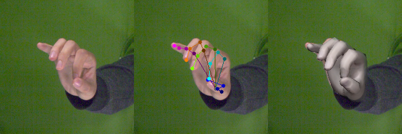

# FreiHAND - Toolbox



FreiHAND is a dataset for evaluation and training of deep neural networks for estimation of hand **pose** and **shape** from single color images, 
which was proposed in our [paper](https://lmb.informatik.uni-freiburg.de/projects/freihand/).
Its current version contains 32560 unique training samples and 3960 unique evaluation samples. 
The training samples were recorded with a green screen background allowing for background removal. 
We provide 3 additional _sample_versions_ for each training sample using different post processing strategies yielding a total training set size of 130240 samples.

This repository contains a collection of scripts that show how the dataset can be used.
See the [project page](https://lmb.informatik.uni-freiburg.de/projects/freihand/) for additional information.


# Basic setup

1. Download the dataset. See project page for instructions.

2. Install basic requirements:
    ```
    virtualenv -p python2.7 ./venv
    source venv/bin/activate
    pip install numpy matplotlib scikit-image transforms3d tqdm opencv-python cython
    ```
    
3. Assuming ${DB_PATH} is the path to where you unpacked the dataset (path to where _./training/_ and _./evaluation/_ folder branch off). 
This should enable you to run the following to show some dataset samples.
In my case ${DB_PATH} holds the value `~/FreiHAND_pub_v2/`
    ```
    python view_samples.py ${DB_PATH}
    python view_samples.py ${DB_PATH} --show_eval 
    ```
    
The script provides a couple of other parameters you might want to try. Note that for visualization of the hand shape you need to follow the **Advanced setup**.


# Advanced setup (allows for visualization of MANO shape annotation)

1. Download Models&code from the MANO website
    ```
    http://mano.is.tue.mpg.de
    ```
    
2. Assuming ${MANO_PATH} contains the path to where you unpacked the downloaded archive use the provided script to enable visualization of the hand shape fit. See the section __Mano version__ for a known caveat.
    ```
    python setup_mano.py ${MANO_PATH}
    ```

3. Install OpenDR

    Getting OpenDR installed can be tricky. Maybe you are lucky and the pip install works for your system. 
    ```
    pip install opendr
    ```
    But there is a known [issue](https://github.com/mattloper/opendr/issues/30) with a library. On my system the pip install didn't work and I installed the package using:
    ```
    bash install_opendr.sh
    ```
    
4. Visualize samples with rendered MANO shapes
    ```
    python view_samples.py ${DB_PATH} --mano
    ```
    
# Evaluate on the dataset

In order to ensure a fair and consistent protocol, evaluation of your algorithm on FreiHAND is handled through Codalab.
 
1. Make predictions for the evaluation dataset. The code provided here predicts zeros for all joints and vertices.
    ```
    python pred.py ${DB_PATH}
    ```
     
2. Zip the `pred.json` file
    ```
    zip -j pred.zip pred.json
    ```
    
3. Upload `pred.zip` to our [Codalab competition](https://competitions.codalab.org/competitions/21238) website (Participate -> Submit)

4. Wait for the evaluation server to report back your results and publish your results to the leaderboard. The zero predictor will give you the following results
    ```
    Keypoint error 70.79cm
    Keypoint error aligned 4.73cm
    Mesh error 70.84cm
    Mesh error aligned 5.07cm
    F@5mm=0.0, F@15mm=0.0
    F_aliged@5mm= 0.001, F_aligned@15mm=0.031
    ```
    
5. Modify `pred.py` to use your method for making shape prediction and see how well it performs compared to the baselines in our [leaderboard](https://competitions.codalab.org/competitions/21238#results).

# Mano version and FreiHAND v2
The following paragraph is only relevant if you downloaded the dataset **before 22. Oct**.

This dataset was developed with the original version of the MANO shape model, which differs from the one that is currently (Sept. 2019) offered for download. 
If the change in version is not dealt with properly this results into mismatches between the provided keypoint and vertex coordinates and the ones the hand model implementation will yield, 
when the respective hand model parameters are applied to it. Therefore an updated dataset version is offered for download now, where all annotations were converted to be compatible with the new MANO version. 
The conversion is approximate, but the residual mean vertex deviation between versions is 0.6mm on average and does not exceed 6mm for any sample. 
Manual inspection of the respective max deviation samples showed, that the new fits even look a bit better than the old ones.  
Additionally the new version correctly accounts for perspective correction due to cropping of non centered image patches by warping the images.

If you downloaded the dataset or cloned the repository **before 22. Oct** then you should update to the new version, i.e. download the new data and update the code repository.
 
# Terms of use

This dataset is provided for research purposes only and without any warranty. Any commercial use is prohibited. 
If you use the dataset or parts of it in your research, you must cite the respective paper.

    ```
	@InProceedings{Freihand2019,
	  author    = {Christian Zimmermann, Duygu Ceylan, Jimei Yang, Bryan Russel, Max Argus and Thomas Brox},
	  title     = {FreiHAND: A Dataset for Markerless Capture of Hand Pose and Shape from Single RGB Images},
	  booktitle    = {IEEE International Conference on Computer Vision (ICCV)},
	  year      = {2019},
	  url          = {"https://lmb.informatik.uni-freiburg.de/projects/freihand/"}
	}
    ```
